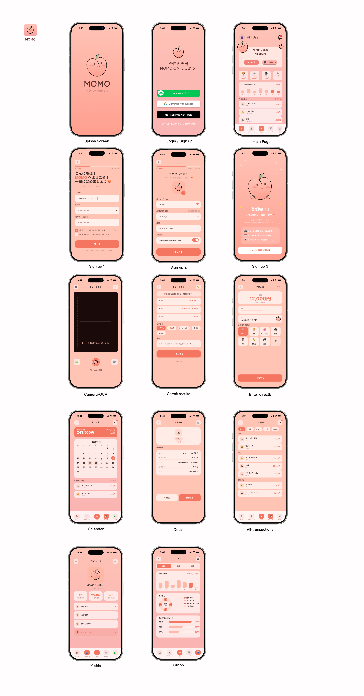

```
momo
├─ .DS_Store
├─ README.md
├─ backend
│  ├─ .env - 환경변수 관리 (DB 비밀번호, JWT 시크릿키 등)
│  ├─ cmd
│  │  └─ main.go
│  ├─ config - DB 연결 설정 등 ex:PostgreSQL 연결, 환경변수 
│  │  └─ db.go
│  ├─ controllers - API 로직 처리 (회원가입, 로그인, 지출 추가 등)
│  │  ├─ authController.go
│  │  └─ expenseController.go
│  ├─ go.mod
│  ├─ go.sum
│  ├─ middleware - JWT 인증 검사
│  │  └─ jwtMiddleware.go
│  ├─ models - DB 테이블 구조체(GORM 모델)
│  │  ├─ expense.go
│  │  └─ user.go
│  ├─ routes - API URL 관리
│  │  └─ routes.go
│  └─ utils - 공용 함수 관리 (bcrypt, JWT 생성 등)
│  │    └─ bcrypt.go - 비밀번호 암호화/검증
│  │    └─ jwt.go - jwt토큰 생성/검증
├─ docker
├─ docker-compose.yml
├─ docs
└─ frontend
   ├─ .DS_Store
   ├─ README.md
   ├─ eslint.config.js
   ├─ index.html
   ├─ package-lock.json
   ├─ package.json
   ├─ public - 정적 파일 보관 (favicon, icon 등)
   │  ├─ favicon.svg
   │  └─ icons.svg
   ├─ src
   │  ├─ App.css
   │  ├─ App.tsx
   │  ├─ api - axios/API 통신 관련
   │  ├─ assets - 이미지, svg 파일 등
   │  │  ├─ hero.png
   │  │  ├─ react.svg
   │  │  └─ vite.svg
   │  ├─ components 
   │  │  ├─ common - 공용 컴포넌트 (Button, Modal, 카드박스 등)
   │  │  └─ layout - 레이아웃 컴포넌트 (Header, Footer 등)
   │  ├─ hooks - 커스텀 훅 관리(useExpense.ts, auth.ts 등)
   │  ├─ index.css
   │  ├─ main.tsx
   │  ├─ pages - 페이지 컴포넌트 관리
   │  ├─ router - React Router 관리
   │  │  └─ index.tsx
   │  ├─ store - Zustand 전역 상태관리
   │  └─ types - TypeScript 타입/interface 관리
   ├─ tsconfig.app.json
   ├─ tsconfig.json
   ├─ tsconfig.node.json
   └─ vite.config.ts

```

## 📝 企画
